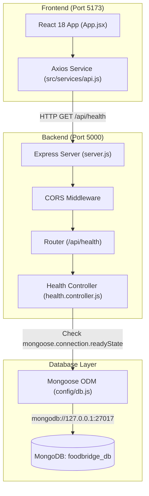

# 🌉 FoodBridge AI — Project Architecture & Understanding Document

## 1. Project Overview

**FoodBridge AI** is an AI-powered food redistribution platform designed to bridge the gap between food donors (restaurants, supermarkets, caterers) and recipients (shelters, food banks, community centers) to minimize food waste and optimize logistics.

Currently, the project is in its **Initial Foundation Phase**. The repository contains a fully established, clean, and verified baseline **MERN (MongoDB, Express, React, Node.js)** stack architecture. The communication pipeline between the React Frontend (Vite), the Express Backend, and the local MongoDB database (`foodbridge_db`) is fully operational. Business domain models and AI features are not yet implemented and are planned for upcoming development iterations.

---

## 2. Hackathon Problem Statement Context

### Target Challenge: PROBLEM STATEMENT 06 — FOODBRIDGE AI

The goal of FoodBridge AI is to build a intelligent food surplus prediction and redistribution system.

#### Intended Hackathon Requirements vs. Current Implementation Status

| Feature / Domain Requirement | Description / Target Scope | Current Project Status |
| :--- | :--- | :--- |
| **Donor Profiles** | Managing restaurants, caterers, grocery store profiles & locations | **Not implemented yet** |
| **Recipient Profiles** | Shelters, food banks, dietary requirements, and storage capacity | **Not implemented yet** |
| **Food Donation Tracking** | Food type, quantity, preparation time, pickup window, shelf life | **Not implemented yet** |
| **Food Surplus Prediction AI**| Machine learning / AI model predicting food waste risk before it occurs | **Not implemented yet** |
| **AI Donor-Recipient Matching**| Constraint-based AI algorithm for optimal distance, capacity & diet matching | **Not implemented yet** |
| **Pickup Priority Queue** | Real-time scheduling & urgency prioritization for perishable items | **Not implemented yet** |
| **Distribution Explainer** | AI explaining why a specific donor-recipient pair was recommended | **Not implemented yet** |
| **Meals Saved Dashboard** | Analytics tracking total food rescued, meals served & CO2 offset | **Not implemented yet** |
| **MERN Foundation** | Clean separation of React frontend, Express API server & Mongoose DB | **Working & Verified** ✓ |

---

## 3. Current Tech Stack

### Frontend
- **Framework**: React 18 (via Vite 8)
- **Language**: JavaScript (ES Modules)
- **HTTP Client**: Axios (configured in centralized API service)
- **Styling**: Modern Vanilla CSS (CSS variables, dark mode glassmorphism, responsive grid layout)

### Backend
- **Runtime**: Node.js (ES Modules `"type": "module"`)
- **Web Framework**: Express.js 4
- **Database ODM**: Mongoose 8
- **Middleware**: CORS 2, Dotenv 16, Express JSON body parser
- **Development Tooling**: Nodemon 3

### Database
- **Technology**: MongoDB
- **Target Database Name**: `foodbridge_db`
- **Connection Mode**: Direct via Mongoose ODM (`mongodb://127.0.0.1:27017/foodbridge_db`)

### Development & Version Control
- **Package Manager**: npm
- **Version Control**: Git

---

## 4. Project Structure

```
FOODBRIDGE AI/
├── backend/
│   ├── config/
│   │   └── db.js                 # Mongoose MongoDB connection module
│   ├── controllers/
│   │   └── health.controller.js  # GET /api/health status logic
│   ├── routes/
│   │   └── health.routes.js      # Express router mapping /api/health
│   ├── .env                      # Backend environment variables (PORT, MONGODB_URI)
│   ├── .env.example              # Environment variables template
│   ├── package.json              # Backend script & dependency manifest
│   └── server.js                 # Express server entry point & middleware setup
│
├── frontend/
│   ├── src/
│   │   ├── services/
│   │   │   └── api.js            # Centralized Axios API instance & health check service
│   │   ├── App.jsx               # Main foundation verification dashboard component
│   │   ├── App.css               # Dashboard design system & glassmorphism styles
│   │   ├── main.jsx              # React root entry point
│   │   └── index.css             # Base styles & reset
│   ├── .env                      # Frontend environment variables (VITE_API_URL)
│   ├── .env.example              # Environment variables template
│   ├── package.json              # Frontend dependencies (React, Vite, Axios)
│   └── vite.config.js            # Vite configuration
│
├── .gitignore                    # Prevents node_modules, .env, dist from version control
└── README.md                     # Comprehensive project documentation
```

---

## 5. System Architecture



---

## 6. Existing Features & Data Flow

### Feature: MERN Stack Connection Verification Dashboard

1. **User Action**: The user opens the web application at `http://localhost:5173`.
2. **Mounting**: The [`App.jsx`](file:///c:/Projects/FOODBRIDGE%20AI/frontend/src/App.jsx) component mounts and triggers `useEffect()`, calling `verifyConnection()`.
3. **API Call**: `verifyConnection()` invokes `checkHealth()` from [`src/services/api.js`](file:///c:/Projects/FOODBRIDGE%20AI/frontend/src/services/api.js).
4. **HTTP Request**: Axios sends `GET http://localhost:5000/api/health`.
5. **Express Routing**: [`server.js`](file:///c:/Projects/FOODBRIDGE%20AI/backend/server.js) receives the request, runs CORS validation, and delegates to [`routes/health.routes.js`](file:///c:/Projects/FOODBRIDGE%20AI/backend/routes/health.routes.js).
6. **Controller Logic**: [`controllers/health.controller.js`](file:///c:/Projects/FOODBRIDGE%20AI/backend/controllers/health.controller.js) checks `mongoose.connection.readyState`:
   - `0`: Disconnected
   - `1`: Connected
   - `2`: Connecting
   - `3`: Disconnecting
7. **JSON Response**: Returns HTTP status 200 with JSON payload containing backend message and MongoDB status.
8. **UI State Update**: [`App.jsx`](file:///c:/Projects/FOODBRIDGE%20AI/frontend/src/App.jsx) updates react state and displays connection status indicators (Connected ✓ / Disconnected ✗) along with the raw payload.

---

## 7. Database Analysis

- **Database Engine**: MongoDB
- **Object Data Modeling (ODM)**: Mongoose
- **Connection File**: [`backend/config/db.js`](file:///c:/Projects/FOODBRIDGE%20AI/backend/config/db.js)
- **Active Connection String**: `process.env.MONGODB_URI` (`mongodb://127.0.0.1:27017/foodbridge_db`)
- **Database Connection Behavior**: Asynchronous non-blocking connection initiated on server boot (`server.js`). Connection errors are caught and logged without crashing the Express process, allowing health checks to gracefully report database status.
- **Existing Schemas & Models**: **Not implemented yet.** (No Mongoose schemas or models are defined in the backend codebase yet).

---

## 8. API Analysis

### Existing API Endpoints Table

| Method | Endpoint | Purpose | Authentication | Used By |
| :--- | :--- | :--- | :--- | :--- |
| `GET` | `/` | Root API Welcome message & health link | None | Public / Browser |
| `GET` | `/api/health` | Comprehensive server & MongoDB connection status check | None | React Frontend ([`api.js`](file:///c:/Projects/FOODBRIDGE%20AI/frontend/src/services/api.js)) |

*No other endpoints exist currently in the application.*

---

## 9. Environment Variables & Configuration

### Backend Environment Variables (`backend/.env`)

| Variable Name | Purpose | Example / Default Value |
| :--- | :--- | :--- |
| `PORT` | Defines the port on which Express server listens | `5000` |
| `MONGODB_URI` | Connection URI string for MongoDB instance | `mongodb://127.0.0.1:27017/foodbridge_db` |

### Frontend Environment Variables (`frontend/.env`)

| Variable Name | Purpose | Example / Default Value |
| :--- | :--- | :--- |
| `VITE_API_URL` | Base URL of backend API server for Axios calls | `http://localhost:5000` |

---

## 10. Current Project Status

### ✅ Working & Functional
- Separate React (Vite) and Node/Express project setup.
- Centralized Axios client setup (`frontend/src/services/api.js`).
- Mongoose MongoDB connection initialization (`backend/config/db.js`).
- Health check API endpoint (`GET /api/health`).
- CORS middleware configured for development origins.
- Visual connection status dashboard UI in React.

### 🟡 Partially Implemented
- None. (The foundation is complete, feature modules are not yet started).

### ❌ Not Implemented Yet
- User authentication & authorization (JWT, sessions).
- Donor and Recipient profile management.
- Food donation creation, listings, & status tracking.
- AI-based food surplus prediction engine.
- AI matching algorithm & pickup priority queues.
- Impact analytics dashboard (meals saved, carbon reduction).

### ⚠️ Potential Setup Requirements / Notes
- Local MongoDB service must be active on `mongodb://127.0.0.1:27017` for database health status to show `connected`.
- Ensure environment variables in `backend/.env` and `frontend/.env` match local port configurations.

---

## 11. Quick Start Guide for Developers

### Prerequisites
- Node.js (v18 or higher)
- MongoDB installed and running locally on port `27017`

### 1. Backend Setup
```bash
cd backend
npm install
npm run dev
```
*Backend runs at:* `http://localhost:5000`

### 2. Frontend Setup
```bash
cd frontend
npm install
npm run dev
```
*Frontend runs at:* `http://localhost:5173`
